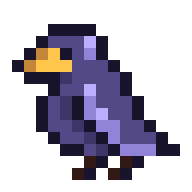

<h1 align="center">
    <br>
    Boids Simulator
</h1>

**Boids Simulator** est une simulation de boids (bird-oid) avec plein de paramètres à modifier, elle a été réalisée avec le module [pyxel](https://github.com/kitao/pyxel).

Le fonctionnement ainsi que les étapes de réalisation sont disponibles dans [ce document](/présentation.md).

## Lancer la simulation
1. Installer les dépendances
```bash
pip install -r requirements.txt
```
2. Exécuter le fichier d'entrée
```bash
py sources/main.py
```